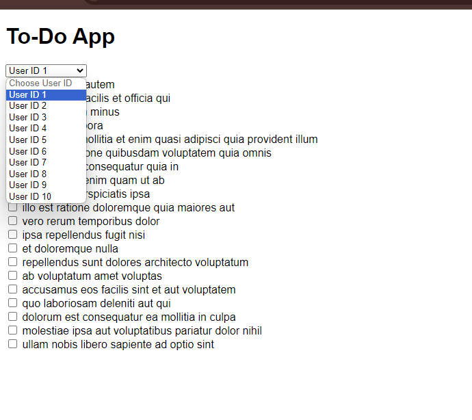
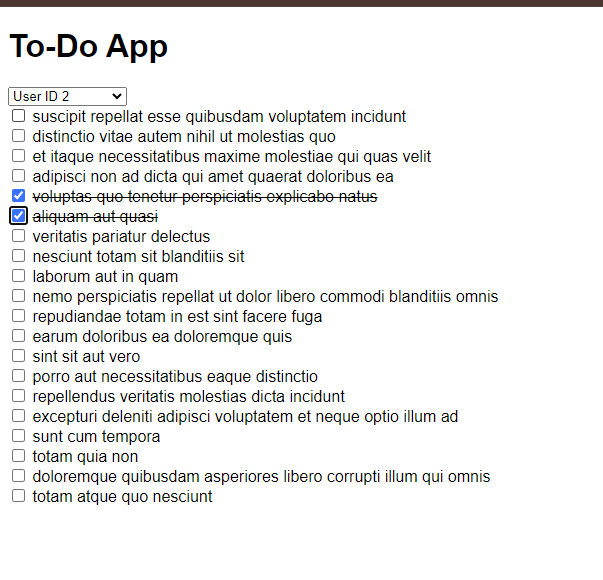

# JSON Placeholder API Fetching

A demo of fetching API in Javascript

## Overview

In this project, I was tasked to fetch data from a public API and filter them accordingly to their respective ID. It taught me how to do data store manipulations using array operations once I've received the data.

I've then added a strikethrough function that persists across different visits of the user posts (what it actually would be like using a to-do list app).

